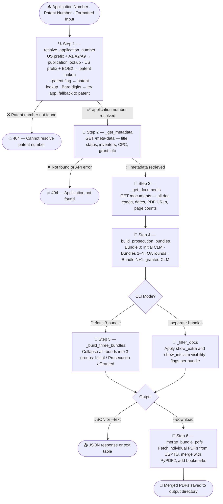

# Patent Prosecution Bundles API — USPTO Patent File Wrapper

<p align="center">
  
  
  
  
  
  
  
</p>

<p align="center">
A standalone CLI and FastAPI web server that retrieves USPTO patent prosecution history, classifies documents into logical prosecution bundles, merges them into downloadable PDFs, and serves them via streaming REST endpoints.<br/>
<strong>bundles_api.py</strong> — core logic + CLI &nbsp;|&nbsp; <strong>bundles_server.py</strong> — FastAPI hosting layer
</p>

---

## 📋 Table of Contents

- [Overview](#-overview)
- [The USPTO Prosecution Bundle Taxonomy](#-the-uspto-prosecution-bundle-taxonomy)
- [Pipeline](#-pipeline)
- [Step-by-Step Breakdown](#-step-by-step-breakdown)
  - [Step 1: resolve_application_number](#step-1-resolve_application_number) — input normalization + patent-to-app resolution
  - [Step 2: _get_metadata](#step-2-_get_metadata)
  - [Step 3: _get_documents](#step-3-_get_documents)
  - [Step 4: build_prosecution_bundles](#step-4-build_prosecution_bundles)
  - [Step 5: _build_three_bundles](#step-5-_build_three_bundles)
  - [Step 6: _merge_bundle_pdfs](#step-6-_merge_bundle_pdfs)
  - [Step 7: get_patent_pdf_url](#step-7-get_patent_pdf_url)
- [Appendix A — Document Classification Codes](#appendix-a--document-classification-codes)
- [Appendix B — Bundle Types and Visibility Tiers](#appendix-b--bundle-types-and-visibility-tiers)

---

## 🎯 Overview

**bundles_api.py** retrieves a USPTO patent application's complete file wrapper via the USPTO Open API, classifies every document into a prosecution bundle, and exposes those bundles as streamable PDFs through both a FastAPI web server and a command-line interface. In its default mode, the tool collapses all prosecution history into three logical PDFs — *Initial Claims*, *Prosecution History*, and *Granted Claims* — making it easy to snapshot where a patent started, how it was examined, and what was ultimately allowed. The `--separate-bundles` mode preserves the full per-round structure for fine-grained review.

**I/O:**

| Direction | Source / Endpoint | Format | Description |
|:---|:---|:---:|:---|
| Input | USPTO API `/meta-data` | JSON | Application title, status, inventors, CPC, grant info |
| Input | USPTO API `/documents` | JSON | All doc codes, dates, page counts, PDF URLs |
| Input | Google Patents page | HTML | Scraped for granted patent CDN PDF URL |
| Input | CLI positional arg | string | Application number (`16123456`), formatted (`16/123,456`), patent grant number (`US10902286`, `US11973593B2`), pre-grant publication number (`US20210367709A1`), or bare patent digits (`11973593 --patent`) |
| Output | stdout / HTTP | JSON | Metadata + bundle list with `download_url` per bundle |
| Output | HTTP | PDF stream | Merged prosecution bundle PDF |
| Output | HTTP | ZIP stream | All bundle PDFs in one archive |
| Output | disk | PDF file(s) | When `--download` flag is passed |

**Input formats accepted:**

| Input | What happens |
|:---|:---|
| `16123456` | used directly as application number |
| `16/123,456` | commas and slashes stripped → `16123456` |
| `US10902286` | `US` prefix → patent-to-app lookup |
| `US11973593B2` | `US` prefix + grant kind code `B2` stripped → patent-to-app lookup |
| `US20210367709A1` | `US` prefix + publication kind code `A1` → publication-to-app lookup |
| `11973593` | tries as application number first; if not found, falls back to patent lookup |
| `11973593 --patent` | `--patent` flag forces patent-to-app lookup directly |

**Setup:**

```bash
pip install fastapi uvicorn requests PyPDF2 python-dotenv

# Create a .env file with your USPTO API key
echo "USPTO_API_KEY=your_key_here" > .env
```

**CLI usage:**

```bash
# Web server
uvicorn bundles_server:app --host 0.0.0.0 --port 7901

# By application number — 3-bundle mode (default)
python bundles_api.py 16123456
python bundles_api.py 16/123,456               # formatted number — auto-stripped
python bundles_api.py 16123456 --text
python bundles_api.py 16123456 --download --output-dir ./pdfs
python bundles_api.py 16123456 | jq .bundles[].download_url

# By patent grant number — auto-resolved to application number
python bundles_api.py US10902286
python bundles_api.py US11973593B2             # kind code stripped automatically
python bundles_api.py 11973593 --patent        # bare digits, force patent route
python bundles_api.py US10902286 --text
python bundles_api.py US10902286 --download --output-dir ./pdfs

# By pre-grant publication number — auto-resolved to application number
python bundles_api.py US20210367709A1          # A1/A2/A9 kind code → publication lookup
python bundles_api.py US20210367709A1 --text

# One PDF per prosecution round
python bundles_api.py 16123456 --separate-bundles
python bundles_api.py 16123456 --separate-bundles --show-extra --show-intclaim
python bundles_api.py 16123456 --separate-bundles --download

# Custom base URL for download_url links (separate-bundles mode)
python bundles_api.py 16123456 --separate-bundles --base-url https://myserver.example.com
```

**API endpoints:**

| Method | Endpoint | Description |
|:---:|:---|:---|
| `GET` | `/resolve/{number}` | Resolve any input format → application number |
| `GET` | `/bundles/{app_no}` | Metadata + all bundles as JSON |
| `GET` | `/bundles/{app_no}/{index}/pdf` | Merged PDF stream for one bundle |
| `GET` | `/bundles/{app_no}/all.zip` | ZIP of all bundle PDFs + full patent PDF (`US{patent_no}.pdf`) |
| `GET` | `/bundles/{app_no}/patent.pdf` | Full granted patent PDF (Google Patents CDN) |

> `/resolve` accepts `force_patent=true` query param. All `/bundles/*` endpoints accept patent grant numbers (e.g. `US10902286`) in addition to application numbers.
> `show_extra` / `show_intclaim` flags apply to the CLI's `--separate-bundles` mode only; the server always uses 3-bundle mode with default-tier documents.

---

## 📖 The USPTO Prosecution Bundle Taxonomy

The tool maps every document in a patent application's file wrapper onto one of three archetypal bundle roles, derived from how USPTO document codes flow during examination:

```
╔══════════════════════════════════════════════════════════════════════════════╗
║  BUNDLE 0 — Initial Claims          ❓ "What was claimed at filing?"        ║
║                                                                              ║
║  The operative CLM document filed with the application. If a Preliminary    ║
║  Amendment (A.PE) was filed within 7 days of the initial CLM, the amended   ║
║  CLM takes priority. Falls back to earliest INCOMING CLM, then earliest     ║
║  CLM of any direction.                                                       ║
╠══════════════════════════════════════════════════════════════════════════════╣
║  BUNDLES 1–N — Office Action Rounds  ❓ "How did the examination unfold?"   ║
║                                                                              ║
║  One bundle per Non-Final (CTNF) or Final (CTFR) Office Action. Each bundle ║
║  anchors on the OA trigger, includes same-day support docs (prior art 892,  ║
║  form paragraphs FWCLM/SRFW/SRNT), and all applicant responses (REM, CLM,   ║
║  AMND, RCE, AFCP) filed before the next OA date. The final round also       ║
║  contains the Notice of Allowance (NOA / ISSUE.NOT).                         ║
╠══════════════════════════════════════════════════════════════════════════════╣
║  BUNDLE N+1 — Granted Claims        ❓ "What was ultimately allowed?"       ║
║                                                                              ║
║  The last CLM document filed after the first OA, present only when a        ║
║  Notice of Allowance has been issued. Represents the final allowed claim set.║
╚══════════════════════════════════════════════════════════════════════════════╝
```

---

## 🔧 Pipeline

The pipeline (core logic in `bundles_api.py`, HTTP layer in `bundles_server.py`) fetches prosecution metadata and documents from the USPTO Open API, classifies each document by code into ordered bundles, then either serves them as streaming HTTP responses (API mode) or writes merged PDFs to disk (CLI `--download` mode). The default path collapses all OA rounds into one middle bundle; `--separate-bundles` preserves the full per-round structure.



---

## 🧩 Step-by-Step Breakdown

### Step 1: resolve_application_number

Normalizes and resolves any input string — application number, patent grant number, or formatted variant — to a clean USPTO application number string.

- **Input:** Any of: application number (`16123456`), formatted number (`16/123,456`), patent grant number (`US10902286`), grant number with kind code (`US11973593B2`), pre-grant publication number (`US20210367709A1`), bare patent digits (`11973593`)
- **Output:** Digits-only application number string (e.g., `"16123456"`)
- **Raises:** `ValueError` when the number cannot be resolved

**Resolution order:**

| Condition | Action |
|:---|:---|
| Input has `US` prefix + publication kind code (`A1`/`A2`/`A9`) | Pass full string to `resolve_publication_to_application()` — queries `earliestPublicationNumber` |
| Input has `US` prefix without publication kind code | Strip prefix + kind code via `_extract_patent_digits()`, query `patentNumber` via `resolve_patent_to_application()` |
| `--patent` / `force_patent=true` | Treat bare digits as patent grant number, query `patentNumber` directly |
| Bare digits (no prefix, no flag) | Try as application number (`GET /meta-data`); if not found, fall back to patent lookup |

**`_extract_patent_digits()` normalization (used for grant numbers only):**

```
US11973593B2  →  strip US  →  11973593B2  →  strip kind code B2  →  11973593
US10902286    →  strip US  →  10902286    →  no kind code        →  10902286
16/123,456    →  strip / , →  16123456    →  (no US prefix)      →  16123456
```

**USPTO patent-to-application search query (grant numbers):**
```
GET /api/v1/patent/applications/search
  ?q=applicationMetaData.patentNumber:{digits}
  &fields=applicationNumberText,applicationMetaData.patentNumber
  &limit=1
```

**USPTO publication-to-application search query (pre-grant publications):**
```
GET /api/v1/patent/applications/search
  ?q=applicationMetaData.earliestPublicationNumber:{full_pub_number}
  &fields=applicationNumberText,applicationMetaData.earliestPublicationNumber
  &limit=1
```

> Note: `earliestPublicationNumber` stores the complete string including `US` prefix and kind code (e.g. `US20210367709A1`). Stripping them before querying returns a 404.

> **Examples:**
> `"US10902286"` → patent lookup → `"16123456"` ·
> `"US11973593B2"` → kind code stripped → patent lookup → application number ·
> `"US20210367709A1"` → publication lookup (full string) → `"16975325"` ·
> `"16/123,456"` → commas/slashes stripped → `"16123456"` (no API call needed)

---

### Step 2: _get_metadata

Calls `GET {BASE_API}/{app_no}/meta-data` with exponential-backoff retry and extracts structured application metadata from the nested `patentFileWrapperDataBag[0].applicationMetaData` response object.

- **Input:** Normalized application number string
- **Output:** Dict with keys: `application_number`, `title`, `status`, `filing_date`, `examiner`, `art_unit`, `docket`, `entity_status`, `app_type`, `patent_number`, `grant_date`, `pub_number`, `pub_date`, `cpc_codes`, `inventors`, `applicants` — or `None` on 404/error
- **Logic:** Pulls inventor city + country from `correspondenceAddressBag[0]`; returns `None` if `patentFileWrapperDataBag` key is absent from the response

> **Example fields:** `title: "Method for Wireless Communication"`, `status: "Patented Case"`, `patent_number: "11234567"`, `examiner: "SMITH, JOHN A"`

---

### Step 3: _get_documents

Calls `GET {BASE_API}/{app_no}/documents` and normalizes each entry in `documentBag` into a flat dict. Results are sorted newest-first by `officialDate`.

- **Input:** Normalized application number string
- **Output:** List of dicts, each with: `code`, `desc`, `date`, `direction`, `pages`, `pdf_url`, `files`
- **Logic:** If `downloadOptionBag` is present, extracts the PDF URL directly; otherwise constructs a fallback: `https://api.uspto.gov/api/v1/download/applications/{app_no}/{doc_id}.pdf`. Normalizes `MS_WORD` MIME type to `DOCX`. Page count falls back to `downloadOptionBag[0].pageTotalQuantity` if `pageCount` is absent.

> **Example entry:** `{"code": "CTNF", "desc": "Non-Final Rejection", "date": "2022-03-15", "direction": "OUTGOING", "pages": 12, "pdf_url": "https://..."}`

---

### Step 4: build_prosecution_bundles

The core classification engine. Iterates over all documents chronologically, anchors each bundle on an OA trigger code, groups same-day support docs and subsequent responses into the same round, and bookends the list with the initial and granted claim bundles.

- **Input:** Normalized application number (calls `_get_documents` and `_find_initial_claims` internally)
- **Output:** List of bundle dicts: `{index, label, type, documents}`
- **Logic:**
  1. **Bundle 0 (initial):** `_find_initial_claims()` selects the operative CLM — prefers CLM within 7 days of a Preliminary Amendment (A.PE), then earliest INCOMING CLM, then earliest CLM of any direction
  2. **Bundles 1–N (round / final_round):** For each CTNF/CTFR anchor, collects same-day `OA_SUPPORTING_CODES` sorted by `_OA_CODE_ORDER`, then all `RESPONSE_CODES | ADVISORY_CODES` dated after the OA and before the next OA
  3. **Bundle N+1 (granted):** The last CLM after the first OA date, only when `NOA_CODES` documents exist

**OA support document ordering (`_OA_CODE_ORDER`):**

| Code | Sort Order |
|:---:|:---:|
| `CTNF` / `CTFR` | 0 |
| `892` | 1 |
| `FWCLM` | 2 |
| `SRFW` | 3 |
| `SRNT` | 4 |

> **Example:** An application with 2 OAs produces 4 bundles: `Bundle 0 — Initial Claims`, `Bundle 1 — Round 1 (Non-Final)`, `Bundle 2 — Round 2 (Final) + NOA`, `Bundle 3 — Granted Claims`

---

### Step 5: _build_three_bundles

Collapses the variable-length per-round bundle list from Step 4 into exactly 3 logical groups for the default output mode.

- **Input:** List of bundles from `build_prosecution_bundles()`
- **Output:** List of exactly 3 dicts: `{label, filename, type, documents}`
- **Logic:**
  - **Group 0 (initial):** `initial` bundle documents as-is
  - **Group 1 (prosecution):** All `default`-tier documents from every `round` and `final_round` bundle, merged and sorted by date; the filename is built from whichever of `[REM, CTNF, CTFR, NOA]` are actually present (e.g., `REM-CTNF-NOA`). `ISSUE.NOT` is counted as `NOA` for naming.
  - **Group 2 (granted):** `granted` bundle documents as-is; empty list if not yet granted

> **Example filename for group 1:** Prosecution containing REM + CTNF + NOA → `REM-CTNF-NOA.pdf`

---

### Step 6: _merge_bundle_pdfs

Fetches each document PDF from its `pdf_url` and merges them into a single `io.BytesIO` stream using `PdfWriter`, adding a labeled PDF outline (bookmark) entry per document.

- **Input:** Bundle dict + `show_extra` bool + `show_intclaim` bool
- **Output:** `io.BytesIO` of the merged PDF, or raises `ValueError` if no valid PDFs were retrieved
- **Logic:** Calls `_filter_docs()` to apply visibility tiers; skips documents without a `pdf_url`; each fetched PDF is appended with a bookmark labeled `"{code} — {desc} ({date})"`. Raises `ValueError` when zero PDFs were fetched successfully.

**Filename sanitization regex (applied to bundle label before writing to disk):**

```regex
[^\w\s\-]
```

> **Example bookmark entry:** `"CTNF — Non-Final Rejection (2022-03-15)"` as a PDF outline item in the merged file

---

### Step 7: get_patent_pdf_url

Discovers the full-text granted patent PDF by scraping the Google Patents page for the patent number, trying multiple publication kind codes in sequence.

- **Input:** Patent number string (e.g., `"11234567"`)
- **Output:** Full CDN URL (`https://patentimages.storage.googleapis.com/...`) or `None`
- **Logic:** Iterates over kind codes `["B2", "B1", ""]`; for each, GETs `https://patents.google.com/patent/US{patent_number}{kind_code}/en` and extracts the CDN path via `re.findall`. Returns the first match found.

**Google Patents CDN URL extraction pattern:**

```regex
patentimages\.storage\.googleapis\.com/([a-f0-9/]+/US{patent_number}\.pdf)
```

> **Example:** For patent `11234567` — tries `US11234567B2`, then `US11234567B1`, then `US11234567`; returns the first successfully extracted CDN URL

---

## Appendix A — Document Classification Codes

The following document code sets govern how documents are classified into bundle roles and visibility tiers. All constants live in `bundles_api.py` and are imported by `bundles_server.py`.

**OA Trigger Codes (`OA_TRIGGER_CODES`) — start a new prosecution round**

| Code | Description |
|:---:|:---|
| `CTNF` | Non-Final Office Action |
| `CTFR` | Final Office Action |

**OA Supporting Codes (`OA_SUPPORTING_CODES`) — same-day OA attachments, `extra` tier by default**

| Code | Description |
|:---:|:---|
| `892` | Prior Art — References Cited |
| `FWCLM` | Form Paragraphs — Claims |
| `SRFW` | Search Report — Forward Citations |
| `SRNT` | Search Report — Notes |

**Response Codes (`RESPONSE_CODES`) — applicant responses following an OA**

| Code | Description | Default Visible |
|:---:|:---|:---:|
| `REM` | Remarks | ✅ |
| `CLM` | Claims | ✅ (initial/granted) · `intclaim` (rounds) |
| `AMND` | Amendment | ❌ (`extra`) |
| `A.1`, `A.2`, `A.3`, `A...`, `A.NE`, `A.NE.AFCP` | Amendment variants | ❌ (`extra`) |
| `AMSB` | Amendment after Final | ❌ (`extra`) |
| `RCEX` | Request for Continued Examination | ❌ (`extra`) |
| `RCE` | RCE document | ❌ (`extra`) |
| `AFCP` | After Final Consideration Pilot | ❌ (`extra`) |

**Advisory Codes (`ADVISORY_CODES`) — `extra` tier**

| Code | Description |
|:---:|:---|
| `CTAV` | Advisory Action |

**Notice of Allowance Codes (`NOA_CODES`) — default visible**

| Code | Description |
|:---:|:---|
| `NOA` | Notice of Allowance |
| `ISSUE.NOT` | Issue Notification (treated as NOA for naming purposes) |

---

## Appendix B — Bundle Types and Visibility Tiers

**Bundle Types**

| Type | Index | Description |
|:---:|:---:|:---|
| `initial` | 0 | Operative initial CLM filed with the application |
| `round` | 1 to N−1 | Intermediate OA + response round |
| `final_round` | N | Last OA round; also contains the NOA when present |
| `granted` | N+1 | Last CLM after first OA; only present when NOA was issued |

**Document Visibility Tiers**

| Tier | Shown by Default | CLI Flag | API Query Param | Applies To |
|:---:|:---:|:---|:---|:---|
| `default` | ✅ | — | — | CTNF, CTFR, NOA, ISSUE.NOT, REM; CLM in `initial`/`granted` bundles |
| `intclaim` | ❌ | `--show-intclaim` | `show_intclaim=true` | CLM docs inside `round` / `final_round` bundles |
| `extra` | ❌ | `--show-extra` | `show_extra=true` | OA support (892, FWCLM, SRFW, SRNT), AMND variants, CTAV, RCE, AFCP variants |

---
